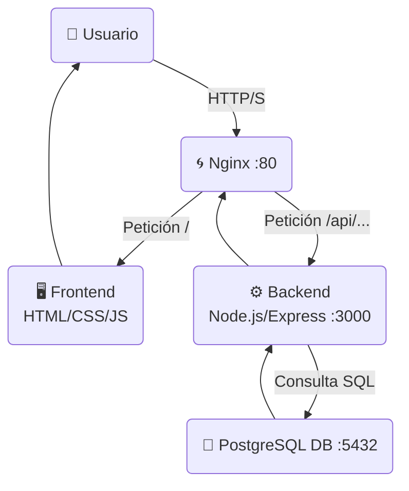

# 📝 Gestor de Tareas — Full Stack

Este es un proyecto de una aplicación web completa de "Gestor de Tareas", desarrollado como una actividad práctica.

El objetivo principal es demostrar la integración de un stack de servicios desacoplados (frontend, backend, base de datos) orquestados con **Docker** y gestionados a través de un proxy reverso con **Nginx**.

---

## ✨ Características (Features)

- ✅ **Crear** nuevas tareas (título y descripción).
- 📄 **Listar** todas las tareas existentes.
- ✏️ **Editar** el título y la descripción de una tarea (a través de un modal).
- 🔄 **Actualizar** el estado de una tarea ("pendiente" o "completada").
- ❌ **Eliminar** tareas.

---

## 🛠️ Stack Tecnológico y Arquitectura

Este proyecto utiliza Docker Compose para levantar y conectar 4 servicios principales:


### Diagrama de Flujo

El usuario **sólo** interactúa con Nginx en el puerto 80. Nginx decide a dónde enviar la petición:



- **🌀 Nginx (Proxy Reverso):**

  - Es el único punto de entrada (puerto `80`).
  - Sirve los archivos estáticos del `frontend` cuando se accede a la ruta `/`.
  - Redirige todas las peticiones a `/api/...` al servicio `backend`.

- **🖥️ Frontend:**

  - HTML, CSS y JavaScript (Vanilla).
  - No sabe que el backend existe en otro puerto. Simplemente hace `fetch` a `/api/tasks`.

- **⚙️ Backend (API):**

  - API REST desarrollada en Node.js, Express y TypeScript.
  - Maneja toda la lógica de negocio y se conecta a la base de datos.
  - _No está expuesto_ al exterior, solo Nginx puede hablar con él.

- **🐘 PostgreSQL:**

  - Base de datos SQL que almacena las tareas.
  - Utiliza un volumen de Docker (`db-data`) para persistir la información.

---

## 🚀 Cómo Empezar (Getting Started)

### Prerrequisitos

Asegúrate de tener instalado:

- [Docker](https://www.docker.com/get-started)
- [Docker Compose](https://docs.docker.com/compose/install/) (generalmente viene con Docker Desktop)

### 1\. Clonar el repositorio

```bash
git clone https://github.com/Alexis217/gestor_tareas.git
cd gestor-de-tareas
```

### 2\. Configurar Variables de Entorno

Crea un archivo llamado `.env` en la raíz del proyecto (al mismo nivel que `docker-compose.yml`) y añade las credenciales de la base de datos.

**`gestor-de-tareas/.env`**

```ini
DB_USER=postgres
DB_PASSWORD=mysecretpassword
DB_NAME=task_manager_db
```

### 3\. Levantar los Servicios

Usa Docker Compose para construir las imágenes e iniciar todos los contenedores en segundo plano.

```bash
docker-compose up -d --build
```

- `up -d`: Inicia los contenedores en modo "detached" (segundo plano).
- `--build`: Fuerza la reconstrucción de las imágenes (necesario si cambias el código).

### 4\. Acceder a la Aplicación

¡Listo\! Abre tu navegador y ve a:

**➡️ `http://localhost`**

---

## 📂 Estructura de Carpetas

```
gestor-de-tareas/
├── 🐋 .env                 # Variables de entorno de Docker
├── 🐋 docker-compose.yml    # Orquestador principal
│
├── ⚙️ backend/
│   ├── Dockerfile
│   ├── package.json
│   ├── tsconfig.json
│   └── src/
│       ├── app.ts
│       ├── server.ts
│       ├── config/
│       ├── controllers/
│       ├── dtos/
│       ├── models/
│       ├── routes/
│       └── services/
│
├── 🖥️ frontend/
│   ├── index.html
│   ├── style.css
│   └── app.js
│
└── 🌀 nginx/
    └── nginx.conf         # Configuración del proxy reverso
```

---

## 📡 Endpoints de la API

Todas las rutas están prefijadas con `/api`.

| Método   | Ruta         | Descripción                                         |
| :------- | :----------- | :-------------------------------------------------- |
| `GET`    | `/tasks`     | Obtiene la lista de todas las tareas.               |
| `POST`   | `/tasks`     | Crea una nueva tarea.                               |
| `GET`    | `/tasks/:id` | Obtiene una tarea específica por su ID.             |
| `PUT`    | `/tasks/:id` | Actualiza una tarea (título, descripción o estado). |
| `DELETE` | `/tasks/:id` | Elimina una tarea por su ID.                        |
